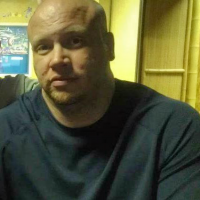

## George Craig - Bio
### CSR Development, Co.

[Chat Application](ChatApplication1.png)

[Closed Caption Application](Application2.png)

Hi, I'm deaf. 

Recently, I suffered head trauma from an autoimmune disease called Nuerosarcoidosis. 1 in 100,000 get this disease. Of all the luck =D. First discovered in 1948, there are no cures and no known causes. 2 in 5 recover. It is manageable; yet, many do not without extensive drug therapy and surgery as an option. Cranial nerves #5, 7, and 8 are inflamed covering a brain stem lesion leaving me with (constant) vertigo, inability to hear, very loud tinnitus, massive pain, dizziness, immobility to move my face (I can't close my mouth) and drool (Haha). I hear voices and music constantly; this condition is extremely debilitating. I hear noises and sounds in my head that "hurt" - I "feel" brain pain. I.e., Delicate connections between senses have been established. I can hit my nose, hear it, and feel pain. Because of the medication, I am now diabetic.

I have had countless procedures completed: MRIs, CAT Scans, Lumbar Punctures, XRays, biopsies - including a brain biopsy in which I woke up in the middle of it! I have been suffering this disease since July 2013. Every waking moment is a challenge and pure hell. The number of medications I am on is roughly 12-14. However, I can only afford 2-3 at a time. I have outstanding IV IG injections pending and have applied for Medicaid and Disability. I have been approved via two letters and all the necessary medical paperwork; still, I continue to look for work every single day. Thankfully, cognition, memory, reason, and personality all remain in tact. Communication is difficult and I've recently started to learn ASL. I know approximately 20-30 signs. It sure beats using pad and paper everywhere you go.

I remain optimistic, but scared. The productivity I've realized is intense, exciting, and fun. However, the loss of music and the possibility I will never hear my grandkids' voices, depresses me. Therefore, I turn to others, to help them. **To give, is to give me a life worth meaning.**

Over night, I lost my job, my house, my car, and my children. Congress stopped my unemployment; therefore, I have no income. The doctors concur I may need brain surgery and disability takes a very long time for approval. Thankfully, I have a wonderful lady, my ex-wife who took the children and are raising them fantastically. We always shared custody, so the relationship has always been healthy. My girlfriend and her mother saved me by allowing me to stay in their home. Without their help, I would be homeless. I certainly am not bitter with my employer as this condition has made communication somewhat difficult. Delivery can still be achieved, I believe. I still can think, I still can code, I still can deliver.

I am a software developer. Yet, despite all of my ailments, I want to give back. I want to help other deaf people. I want to write accessibility apps on hardware like Android and iOS. I want to write applications that will help people via closed caption and give it all away _**FREE**_. Pay it forward. Can you help me with some donations? I am desperately capable of being extremely productive. I am looking for:

- 1 Mac computer
- 2 Android tablets
- 2 iPad minis
<!--  
<del>2 Android tablets</del> - I have 2 Android phones I can use for hardware testing! **GRACIOUSLY Donated by Lisa Lopez.** Thank you, Lisa!
<del>2 iPad minis</del> - I can use iPad tablets/minis, but I have acquired an iPhone 4 and iPad2. I can use these for testing! -->
- <del>mechanical keyboard</del> - **GRACIOUSLY Donated by Jeff Atwood from WSAD and Coding Horror**. Please check out his blog, if you have any interest in technology. Thank you, Jeff! [http://blog.codinghorror.com/]() Seriously, mechanical keyboards allow you to really bang out code. It's for serious development. Anyone taking their craft serious, needs serious tools. I recommend Jeff's CODE Mechanical keyboard: [http://codekeyboards.com/]()  

to realize my dream for mobility applications. I will graciously accept anything working, refurbished, knocked, dinged, and cost range. I don't care. At the release of the product(s): 3 months, I will donate the tablets and iPads to charity as well (or return them to you directly). The Mac will be needed for bug releases, etc.

At any time I can prove my condition and the progress of my charity work. I plan on publishing all the source code to github.com in the public domain. Monitoring that is easy. [http://github.com/gcraig.](http://github.com/gcraig)

Will you please help me by donating either or all of those items? I can prove all of this is true and that I have the passion to help many people in your name. I will certainly remain a loyal customer and push your stores/business/etc. I will also prominently display your name in all my documentation. 

I want to start with two applications. One that allows chatting via Bluetooth so no wifi (internet) is required, including calls to voice recognition services. The second will display closed captions on broadcasts, remotely, i.e., in movie theaters. etc. Raspberry Pi hardware will help me interface to those signals. 

Connecting the device to a computer and broadcasting that could allow deaf people to follow the movie or video stream in public.

Please let me know what you think.  
Sincerely, 
Thank you,

George A. Craig. 
[gcraig@csrdevco.com](mailto:gcraig@csrdevco.com) 
[georgeacraig@gmail.com](mailto:georgeacraig@gmail.com)  

CSR Development, Co. 
[www.csrdevco.com](http://www.csrdevco.com)
